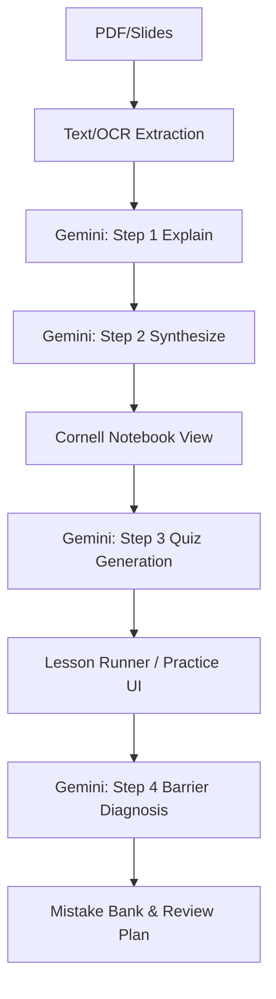

# FishCapsule 🐟
### Your Agentic Study Notebook: Turn PDFs into a Duolingo-style Learning Loop.

[**Live Demo**](https://fish-capsule.vercel.app/)

## 🚀 What it does
FishCapsule transforms passive reading into active mastery. It breaks down complex documents into a **6-step agentic learning loop**:

1.  **Explain** — Page-by-page, plain-English breakdowns of complex concepts.
2.  **Synthesize** — Cross-page thematic integration to connect the dots.
3.  **Quiz** — Interactive Cloze (fill-in-the-blank) and MCQ tests generated instantly from your notes.
4.  **Diagnose** — Identifies specific learning barriers: *Concept*, *Mechanics*, *Transfer*, or *Communication*.
5.  **Plan** — Automatically creates a micro-task list and spaced repetition schedule (1d/3d/7d).
6.  **Review** — A dedicated "Mistake Bank" for focused retrieval practice on your weakest points.

## ✨ Key Features
- **AI-Driven Cornell Notes** — Structured cues, high-density notes, and evidence-anchored summaries.
- **Adaptive Practice** — Gamified sessions with XP, streaks, and instant feedback.
- **Mistake Bank** — Automatically captures errors for smart "Today Review" sessions.
- **OCR-Ready** — Intelligent trigger for figure-heavy or low-text PDF pages.
- **Immersive UI** — 3D starfield landing page and premium dark-mode notebook interface.

## ♊ Gemini Usage
FishCapsule is built to leverage the speed and reasoning of the Gemini family.

- **Current Model**: `gemini-2.5-flash-lite` (used for high-speed page-by-page extraction and explanation).
- **Secondary/Fallback**: `gemini-2.5-flash` (used for synthesis, quiz generation, and barrier diagnosis).
- **Submission Target**: We are currently migrating all core "Agentic" reasoning tasks to **Gemini 3 Flash (Preview)** before final submission to maximize logic-heavy diagnostic accuracy.

**Gemini handles:**
- **Information Extraction**: Identifying core ideas and evidence snippets from raw PDF/OCR text.
- **Pedagogical Transformation**: Converting academic text into "Plain-English" and "Vivid Examples".
- **Instructional Design**: Generating retrieval-driven cues and cloze questions.
- **Learner Diagnosis**: Analyzing answer patterns to tag specific cognitive barriers.

## 🛠️ Quick Start

```bash
# 1. Clone & Install
npm install

# 2. Configure Environment
cp .env.example .env.local
# Add your GEMINI_API_KEY to .env.local

# 3. Launch Development Server
npm run dev
```
Open [http://localhost:3000](http://localhost:3000) to start studying.

## 🔑 Environment Variables
| Variable | Description | Required |
| :--- | :--- | :--- |
| `GEMINI_API_KEY` | API Key from Google AI Studio. | **Yes** |
| `ZAI_API_KEY` | Alternative key for Z.ai endpoints (optional). | No |
| `GLM_MODEL` | Model name override (defaults to `glm-4.5-flash`). | No |

> [!WARNING]
> **Security First**: Ensure these keys are stored server-side only. Never expose your `.env` or API keys in client-side code.

## 🧪 How to Test (Judge's Guide)
1.  **Upload**: Navigate to the landing page and upload any academic PDF or slide deck.
2.  **Select**: Choose a page range (e.g., Pages 1–3) to focus your study session.
3.  **Process**: Click "Process" and watch as the **Explain** & **Synthesize** steps populate your Cornell Notebook.
4.  **Study**: Review the **Cues** (questions) and **Notes** (explanations) in the sidebar.
5.  **Practice**: Click the "Practice" tab and start a **Lesson**. Answer the Cloze questions.
6.  **Diagnose**: Complete the lesson to see your **XP**, **Accuracy**, and **Learning Barrier** diagnosis.
7.  **Review**: Open your **Mistake Bank** to see how the app schedules your review session.

## 🏗️ Architecture


## 💻 Tech Stack
- **Framework**: Next.js 14 (App Router)
- **AI SDK**: `@google/generative-ai`
- **Styling**: Tailwind CSS + Shadcn UI
- **3D/Visuals**: Three.js + React Three Fiber
- **Validation**: Zod
- **Storage**: IndexedDB (idb) + LocalStorage
- **PDF Processing**: pdfjs-dist + Tesseract.js (OCR)

## 🗺️ Roadmap
- [ ] **RAG Integration**: Semantic search across all uploaded notebooks.
- [ ] **Multi-pass Logic**: "LLM-as-a-judge" for open-ended answer grading.
- [ ] **Social Study**: Shared mistake banks and competitive streaks.

## 📄 License
MIT © 2026 Junhao (Harley) Jia
